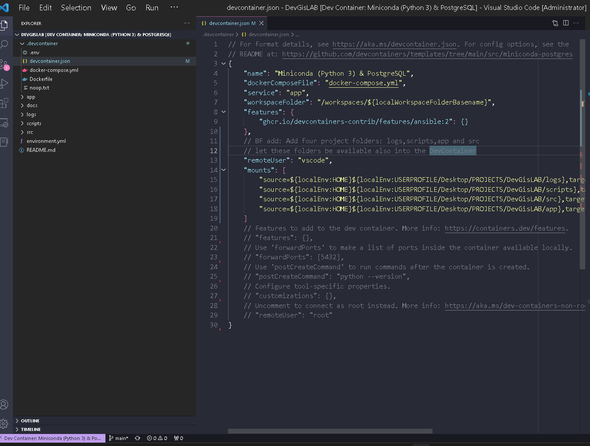
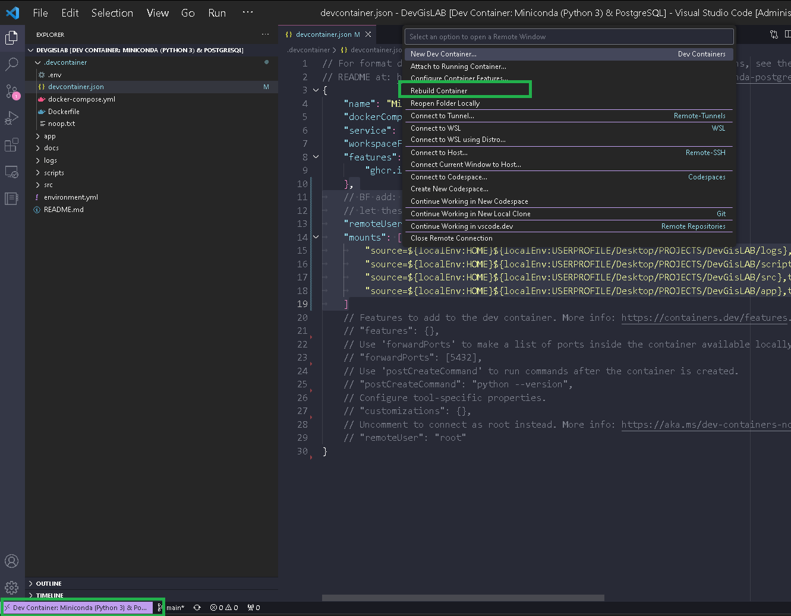
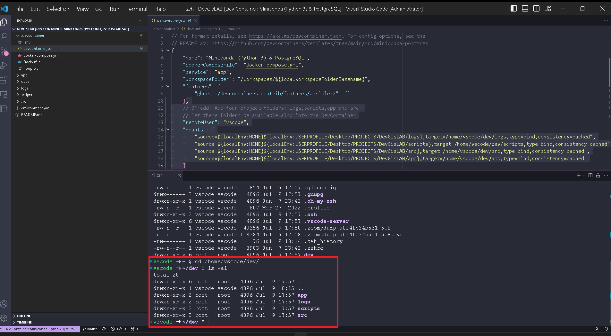

# Add New Project Folders to DevContainer


How top add


1. Create **4** new folders in the Project DevContainer:

```powershell
mkdir logs
mkdir src
mkdir scripts
mkdir app
```

1. In file **`devcontainer.json`** Add the following statements to the file:

```json
// BF add: Add four project folders: logs,scripts,app and src 
// let these folders be available also into the DevContainer
	"remoteUser": "vscode",
	"mounts": [
		"source=${localEnv:HOME}${localEnv:USERPROFILE/Desktop/PROJECTS/DevGisLAB/logs},target=/home/vscode/dev/logs,type=bind,consistency=cached",
		"source=${localEnv:HOME}${localEnv:USERPROFILE/Desktop/PROJECTS/DevGisLAB/scripts},target=/home/vscode/dev/scripts,type=bind,consistency=cached",
		"source=${localEnv:HOME}${localEnv:USERPROFILE/Desktop/PROJECTS/DevGisLAB/src},target=/home/vscode/dev/src,type=bind,consistency=cached",
		"source=${localEnv:HOME}${localEnv:USERPROFILE/Desktop/PROJECTS/DevGisLAB/app},target=/home/vscode/dev/app,type=bind,consistency=cached"
	]
```

<figure><figcaption><p>Add the folders to the devcontainer.json file</p></figcaption></figure>

After adding the mount statements to the devcontainer.json file , rebuild the DevContainer , select the remote container from the left corner and then choose the **`Rebuild Container`** option:

<figure><figcaption><p>Rebuild DevContainer</p></figcaption></figure>

Then check the existence of the newly created folder into DevContainer:

<figure><figcaption></figcaption></figure>
