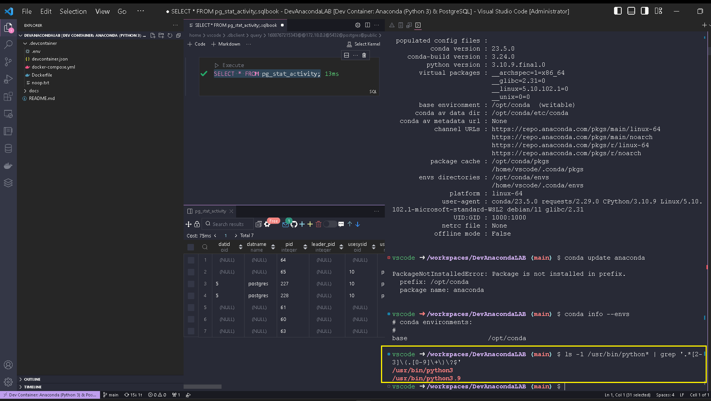
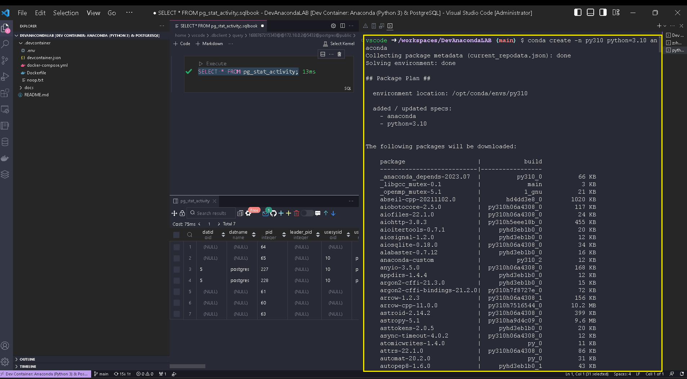
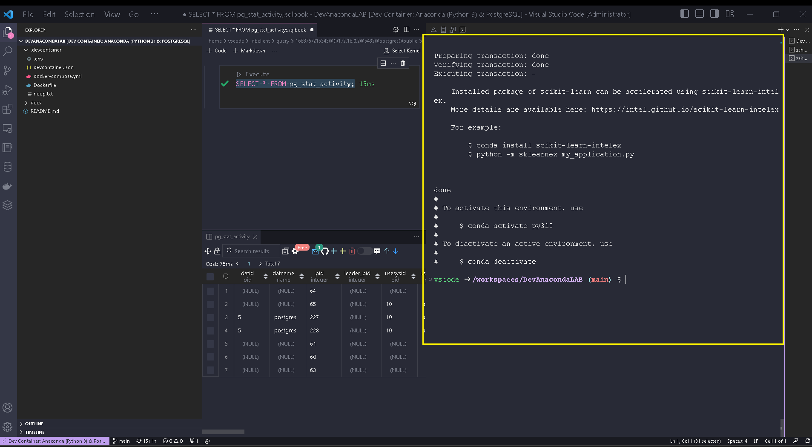
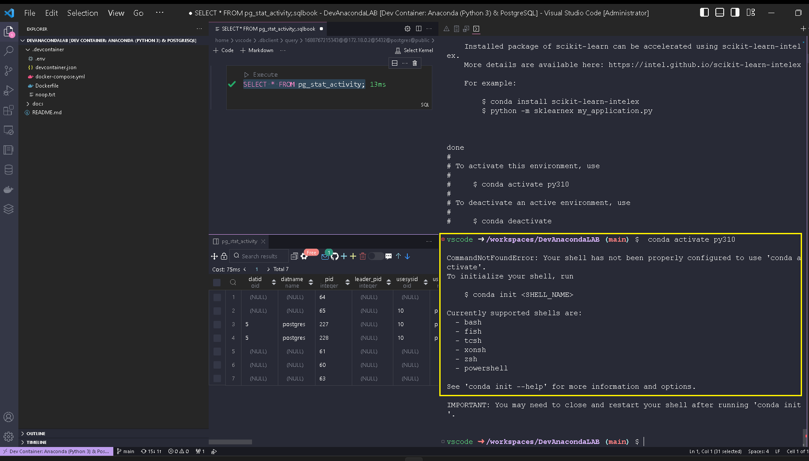
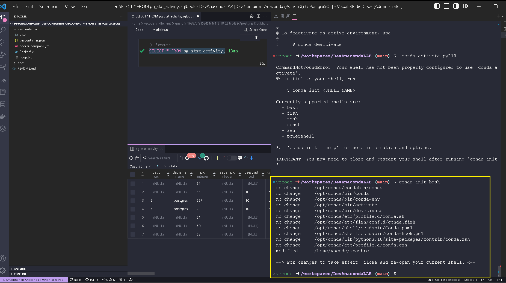
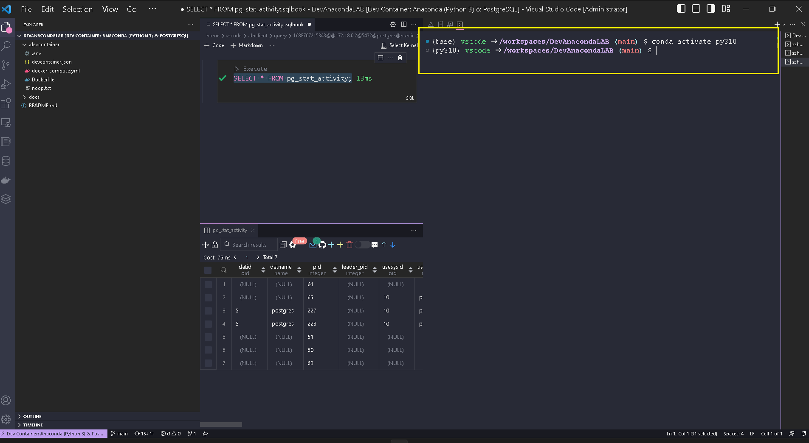
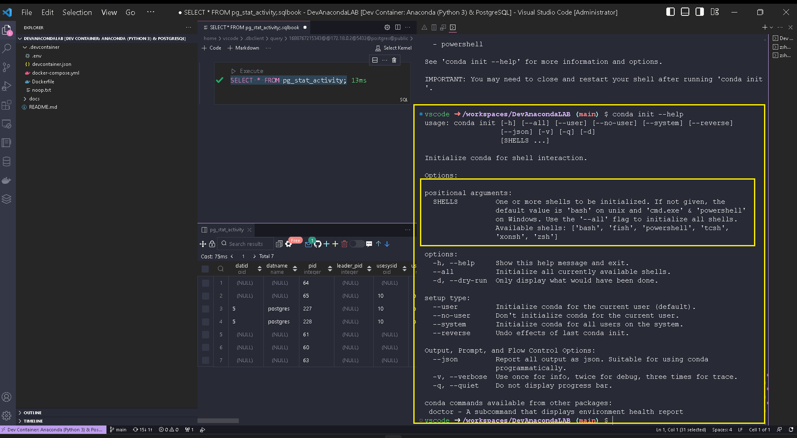

# Set up virtual environment for Python using Anaconda


Use This Link:

[**Set up virtual environment for Python using Anaconda**](https://www.geeksforgeeks.org/set-up-virtual-environment-for-python-using-anaconda/)


### **Step 1: Check if conda is installed in your path.**

```bash
conda -V
# Update conda
conda update conda
```

**Check  conda version**

```bash
conda info | egrep "conda version|active environment"
```

**Step 2: Set up the virtual environment**

*   Type conda search “

    ```python
    ls -ls /usr/bin/python*
    ```

    ” ,or:&#x20;

    ```python
    ls -1 /usr/bin/python* | grep '.*[2-3]\(.[0-9]\+\)\?$'
    ```

&#x20;to see the list of available python versions.

<figure><figcaption><p>Check Python version already installed</p></figcaption></figure>

* Now replace the envname with the name you want to give to your virtual environment and replace x.x with the python version you want to use.

### [Installing a different version of Python](https://conda.io/projects/conda/en/latest/user-guide/tasks/manage-python.html#id2)

To install a different version of Python without overwriting the current version, create a new environment and install the second Python version into it:

1. Create the new environment:
   *   To create the new environment for Python 3.10, in your terminal window or an Anaconda Prompt, run:

       ```bash
       conda create -n py310 python=3.10 anaconda
       ```

<figure><figcaption><p>Install new Python version Python3.10 for Anaconda</p></figcaption></figure>


**NOTE**

Replace `py310` with the name of the environment you want to create. `anaconda` is the metapackage that includes all of the Python packages comprising the Anaconda distribution. `python=3.10` is the package and version you want to install in this new environment.


Activate the created virtual environment with the new python version (3.10):

<figure><figcaption><p>Activate new py310 environment</p></figcaption></figure>

To initialize shell from a list of shells especially for the running of conda commands, use `bash` shell:

<figure><figcaption><p>The list of existing Shell types</p></figcaption></figure>

Use `Bash` or `ZSH` shell On **LINUX** for conda:

<figure><figcaption><p>Use Bash or ZSH Shell</p></figcaption></figure>


To activate the new environment py310, open new Bash or ZSH Terminal and run the command:

$ **conda activate py310**


<figure><figcaption></figcaption></figure>

**NOTE:** On **Windows** use : CMD or PowerShell , check that by running

```bash
conda init --help
```

<figure><figcaption></figcaption></figure>

**Then Activate.**

* To list all environment created on this docker container , use this conda command:

```bash
conda info --envs
```

* To Install Any new packages in the already created virtual environment , run the following command:

```bash
conda install -n yourenvname package
```
